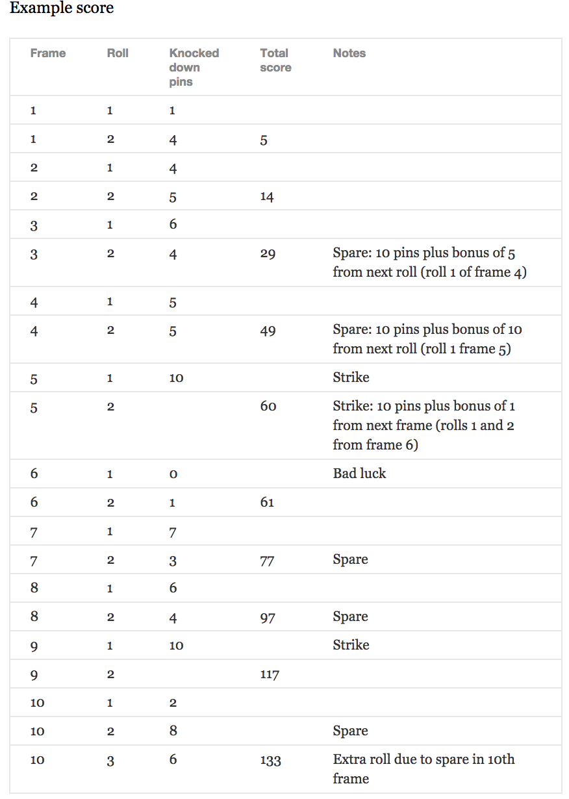

BOWLING SCORECARD PROGRAM in ruby
=================

## The Task

Count and sum the scores of a bowling game for one player.

## Testing:

1. Fork and clone this repo
2. `cd` into the folder
3. Run `rspec` in the project directory


## Tech Used:

- Ruby
- Rspec
- Rubocop

## Bowling — how does it work?

In the image below you can find some score examples.



### Planning

*potential input* 
```
{ frame_1: [1, 4],
  frame_2: [4, 5],
  frame_3: [6, 4],
  frame_4: [5, 5],
  frame_5: [10], 
  frame_6: [0, 1], 
  frame_7: [7, 3], 
  frame_8: [6, 4], 
  frame_9: [10], 
  frame_10: [2, 8, 6]
}

```
*score output* 

``` 
Total score: 133
```
